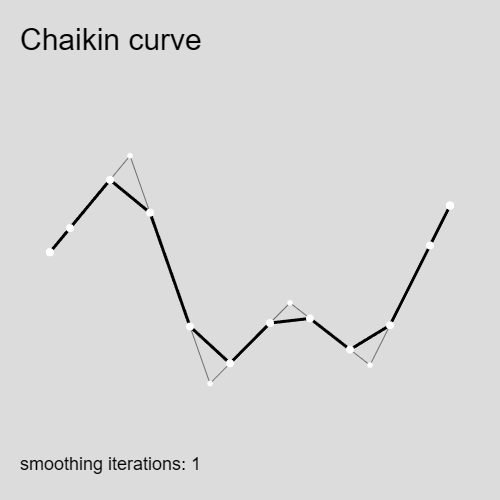

# Chaikin's algorithm
 A small demonstration of George Chaikin's 1974 corner cutting algorithm for drawing curves in p5.js

## The Algorithm
Chaikin's algorithm is a corner-cutting process used to generate smooth curves from a set of control points. If you start with a rough zig-zag line, at each iteration, you chop off the corners and make smaller, new edges between the chopped areas. After a few iterations, the path smooths out into a gentle curve.

It goes something like this:

- Start with a set of control points.
- For each pair of consecutive points `A` and `B`, compute two new points:
  - one new point, `Q`, 1/4 along the line between `A` and `B`
  - another new point, `R`, 3/4 along the line between `A` and `B`
  - remove the starting pair (points `A` and `B`)
 - Repeat the process for the new sequence of points. Each iteration halves the number of "sharp" corners and makes the shape closer to a smooth curve.

## Demonstration

See the p5.js code in [/chaikin-demo](/chaiken_demo)

## In use
I used the Chaikin curve in my generative work _WAVETABLE: Four Fucked Waveforms_ (2024)

### References
George Chaikin's son, Paul Chaikin, gives an excellent explanation/demonstration here: <https://observablehq.com/@pamacha/chaikins-algorithm>
