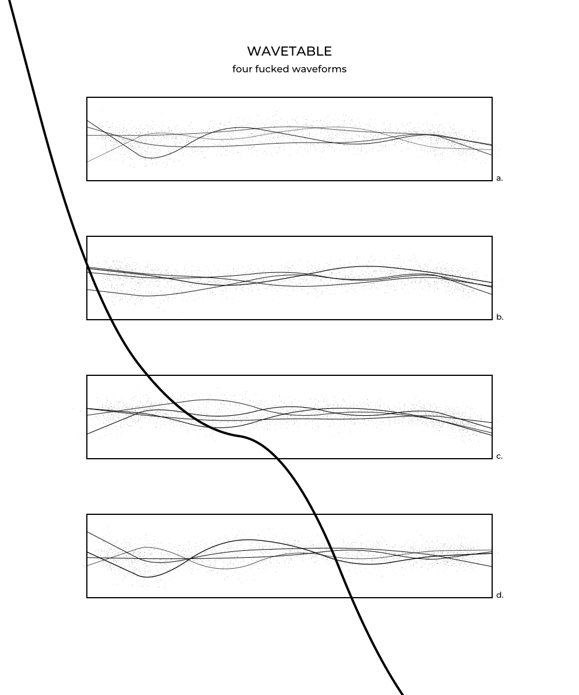

# Chaikin's curve
 A small demonstration of George Chaikin's 1974 corner cutting algorithm for drawing curves in p5.js

I used the Chaikin curve in my generative work _WAVETABLE: Four Fucked Waveforms_ (2024)

### References
George Chaikin's son, Paul Chaikin, gives an excellent explanation/demonstration here: <https://observablehq.com/@pamacha/chaikins-algorithm>